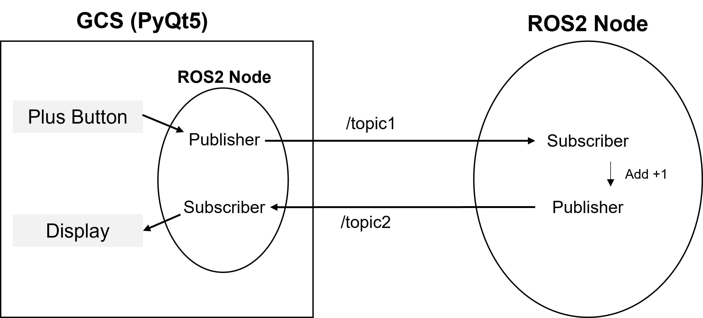

# PyQt5-ROS2-test
PyQt5 <-> ROS2 test  



- GCS에서 "plus button"을 누르면 현재 숫자 전송  
- ROS 노드는 GCS가 전송한 숫자를 받아 +1을 한 뒤 GCS로 전송  
- GCS는 ROS 노드가 전송한 숫자를 화면에 표시  


<br/>

Build and Run
--------
- Docker Container (If needed)  
    To build a docker image (Ubuntu 20.04 + ROS2 galactic),   
    ```
    $ docker-compose build  
    ```
    To run the container
    ```
    # Terminal1
    $ docker-compose up   
    
    # Terminal2
    $ xhost +local:docker
    $ ./bash.sh             
    ```
- Build package:  
    ```
    $ cd [workspace]
    $ colcon build --symlink-install  
    ```
- Test example: 
    ```
    $ source /opt/ros/galactic/setup.bash  
    $ source [workspace]/install/setup.bash

    $ ros2 run pyqt_gcs pyqt_test   // 버튼을 누르면 토픽1을 전송
    $ ros2 run test_topic pubsub    // 토픽1을 받아 1을 더한 후 토픽2로 전송
    ```

<br/>

TODO
--------
- Ctrl+C로 종료 (현재는 UI창 x버튼으로 종료)